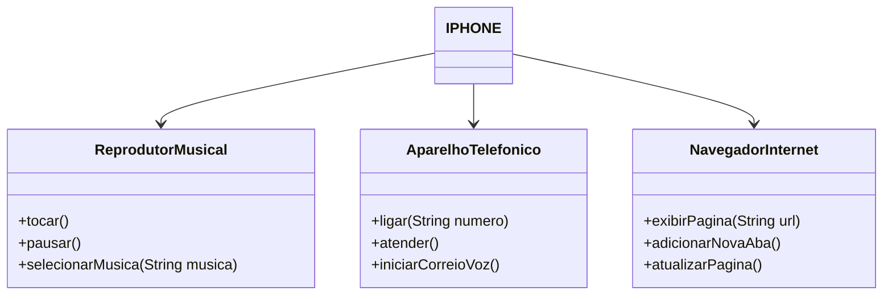

# 📱 Exercício: Diagrama de Classes - Simulação do iPhone

Este projeto tem como objetivo praticar os conceitos de **programação orientada a objetos (POO)**, utilizando interfaces e implementações baseadas em um diagrama de classes representando as funcionalidades básicas de um iPhone.

## 📋 Descrição

A proposta do exercício foi implementar uma classe `IPHONE` que simula as funcionalidades principais de um smartphone da Apple. Essa classe implementa três interfaces distintas, cada uma representando um conjunto de responsabilidades:

* **ReprodutorMusical**: funcionalidades relacionadas à música.
* **AparelhoTelefonico**: funcionalidades de chamadas telefônicas.
* **NavegadorInternet**: funcionalidades de navegação na web.

## 🧩 Diagrama de Classes



## 🛠️ Funcionalidades

Abaixo estão os métodos implementados em cada interface:

### 🎵 ReprodutorMusical

* `tocar()`: Inicia a reprodução da música.
* `pausar()`: Pausa a música atual.
* `selecionarMusica(String musica)`: Escolhe uma nova música para reprodução.

### 📞 AparelhoTelefonico

* `ligar(String numero)`: Realiza uma chamada para o número informado.
* `atender()`: Atende uma chamada recebida.
* `iniciarCorreioVoz()`: Acessa o correio de voz.

### 🌐 NavegadorInternet

* `exibirPagina(String url)`: Exibe uma página web pelo endereço fornecido.
* `adicionarNovaAba()`: Abre uma nova aba no navegador.
* `atualizarPagina()`: Atualiza a página atual.

## ✅ Objetivos do Exercício

* Implementar e aplicar interfaces em Java.
* Utilizar a herança e o polimorfismo de forma prática.
* Simular comportamentos reais com estrutura limpa e coesa.

## 🚪 Como executar

1. **Clone ou baixe** este repositório para sua máquina local.

2. **Compile os arquivos Java** no terminal:

```bash
javac Main.java
```

> Certifique-se de que todos os arquivos `.java` (incluindo os que contêm as interfaces e o record `Iphone`) estão no mesmo diretório ou devidamente organizados em pacotes.

3. **Execute o programa**:

```bash
java Main
```

> A classe `Main` é o ponto de entrada do programa e instanciará o `Iphone` como um `record`, testando suas funcionalidades de reprodutor musical, telefone e navegador.

## 🚀 Considerações finais

Esse exercício reforça a importância da separação de responsabilidades na programação orientada a objetos, mostrando como uma única classe pode assumir múltiplas funcionalidades ao implementar diferentes interfaces.
